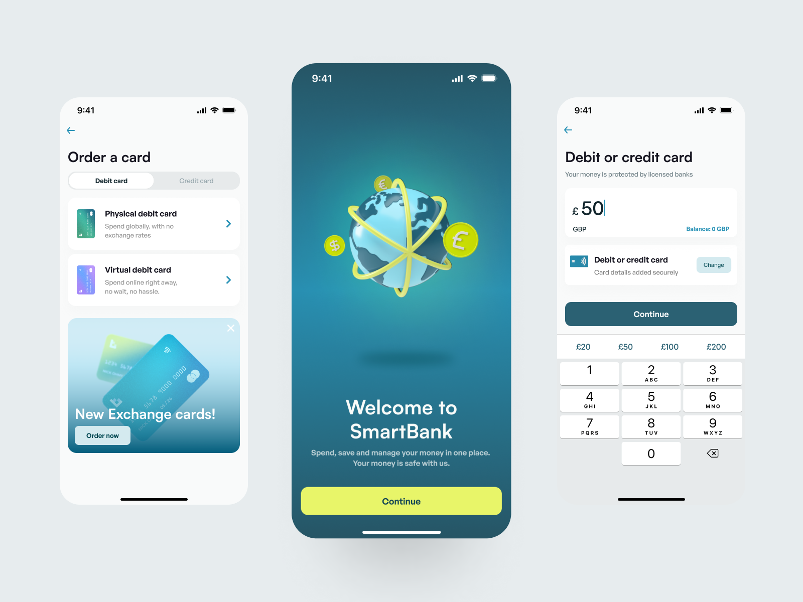

<p align="center">
  <a href="https://github.com/edrickleong/smartbank">
    
  </a>

<h3 align="center">SmartBank</h3>

<p align="center">
    A demo banking app made with React Native and Supabase. 
    <br />
    Designed by <a href="https://twitter.com/uiuxadrian">Adrian Kuleszo</a>
    <br />
    Demo app created by <a href="https://twitter.com/edrickleong_">Edrick Leong</a>
    <br />
    <br />
    <a href="https://github.com/edrickleong/smartbank/issues">Report Bug</a>
    ·
    <a href="https://github.com/edrickleong/smartbank/issues">Request Feature</a>
</p>



This project uses designs from Adrian Kuleszo's
book [The UI Professional's Design Manual](https://uiadrian.gumroad.com/l/design-manual). Support him by purchasing a
copy of his book on [Gumroad](https://uiadrian.gumroad.com/l/design-manual).

## Demo

<p align="center">
  
</p>

## 📱 Flows

These are groups of screens based on the design manual above.
Some of these screens have been created without adding functionality yet. For example,
the phone verifications screens have been created but do not integrate with a phone verification service.

- [x] Walkthrough
- [x] Login
- [x] Account setup
- [x] Phone verification
- [x] Create passcode
- [ ] Legal information
- [ ] Notifications
- [ ] Verify Identity
- [ ] Selfie
- [ ] Create a card
- [ ] Top up account
- [ ] Home screen
- [ ] Transfer money
- [ ] Exchange money
- [ ] Profile settings
- [ ] Upload avatar

## ✨ Features

- [x] 🔒 Sign Up / Log In
- [ ] 📞 Phone Verification
- [ ] 🔐 Setup PIN + Face ID
- [ ] 📷 Photo Verification
- [ ] 🔔 Request for Notifications
- [ ] 👤 Upload Avatar

## 🔧 Built with

- [Expo](https://expo.dev/) - A framework for building React Native apps
- [NativeWind](https://www.nativewind.dev/) - Tailwind CSS for React Native
- [Supabase](https://supabase.com/) - Auth & Database platform

## 🚀 Local Development

1. Install Bun

```shell
brew install bun
```

2Clone the repo

```sh
git clone https://github.com/edrickleong/smartbank
```

3. Install NPM packages

```sh
bun install
```

4. Copy the `.env.example` file as a `.env` file and add the missing environment variables.
   You will need to sign up for a [Supabase account](https://supabase.com/) and create a project.
   You will need to update your Site URL under Authentication > URL Configuration > Site URL to
   `com.edrickleong.smartbank`.

```shell
5. Run the development server

```

bun start

```
